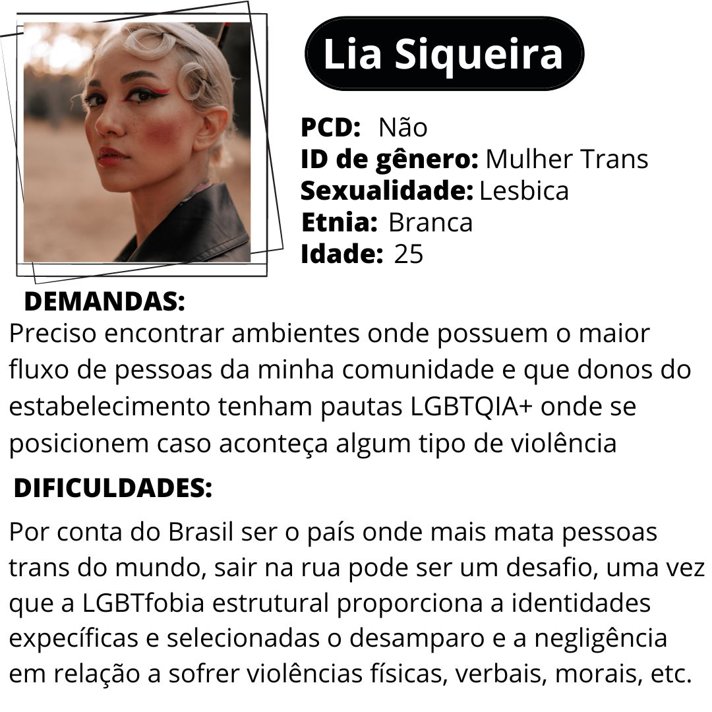
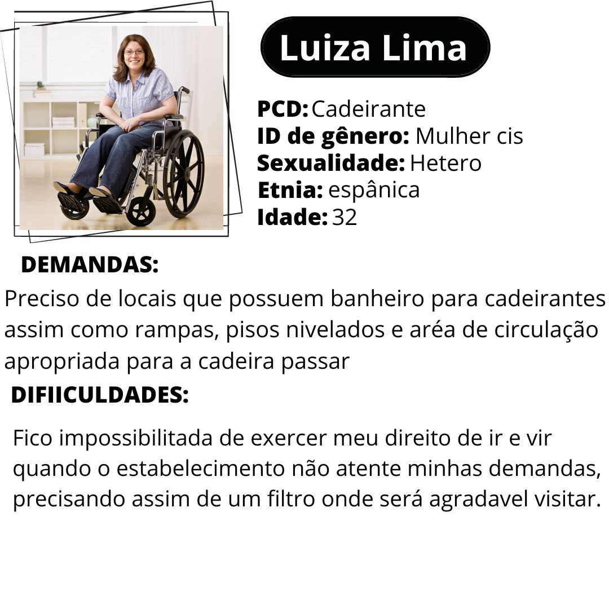
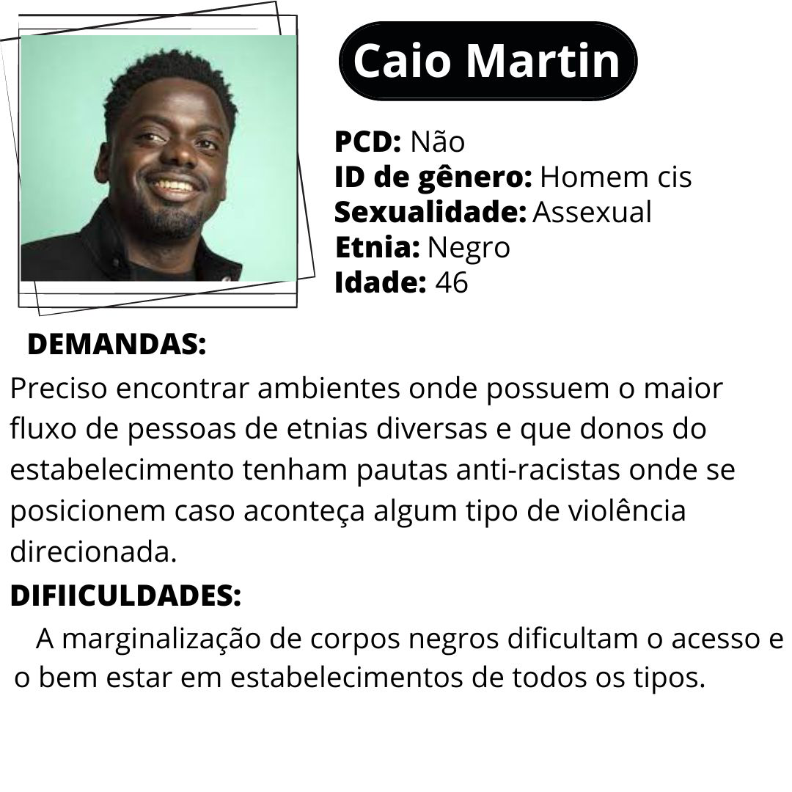

# Informações do Projeto
`TÍTULO DO PROJETO`  

......  PROJETO INCLUIR ......

`CURSO` 

......  ANÁLISE E DESENVOLVILMENTO DE SISTEMAS ......

## Participantes

> Os membros do grupo são: 
> - Amor Thedim Neto Ferreira
> - Gabriela Cristina Freitas de Lima
> - Gledson Cauã Pinheiro Leão
> - Iago Pereira Alves
> - Mariana Martins Moreira
> - Sara Marçal Rocha

# Estrutura do Documento

- [Informações do Projeto](#informações-do-projeto)
  - [Participantes](#participantes)
- [Estrutura do Documento](#estrutura-do-documento)
- [Introdução](#introdução)
  - [Problema](#problema)
  - [Objetivos](#objetivos)
  - [Público-Alvo](#público-alvo)
- [Especificações do Projeto](#especificações-do-projeto)
  - [Personas](#personas)
  - [Histórias de Usuários](#histórias-de-usuários)
  - [Requisitos](#requisitos)
- [Projeto da Solução](#projeto-da-solução)
  - [Wireframes](#wireframes)
  - [Mapa de navegação](#mapa-de-navegação)
- [Conclusões](#avaliação-da-aplicação)
  
# Introdução
  Na sociedade contemporânea, o mundo está em constante evolução, passando por mudanças progressivas e cada vez mais rápidas. Um exemplo claro disso é a revolução digital, que tem causado impactos significativos em diversos setores, bem como as revoluções sociais, que têm promovido transformações profundas na forma como nos relacionamos e nos organizamos como sociedade.

  Dessa forma, em uma sociedade que possui estruturas excludentes o acesso de pessoas com deficiência (PCDs), neurodivergentes, LGBTQIA+ e pessoas não brancas aos ambientes comunitários pode se tornar um desafio significativo. Essa dificuldade resulta na violação de sua dignidade, bem-estar e direitos, sem que medidas efetivas sejam tomadas para resolver essas questões. Sendo assim, infelizmente, essa situação acaba gerando uma vulnerabilidade civil para esses grupos específicos, fato muito corriqueiro no Brasil que, segundo pesquisa “Os Perigos da Percepção”, realizada pelo instituto Ipsos, é o 5º colocado em novo ranking de países ‘mais ignorantes’ do mundo.

  Diante disso, torna-se imprescindível a união entre tecnologia e inclusão, buscando combater o preconceito e proporcionar que os indivíduos citados anteriormente não apenas desfrutem de sua cidadania, mas também enriqueçam a diversidade e a convivência social, contribuindo para uma sociedade mais enriquecida em experiências e perspectivas. Portanto, é fundamental promover e apoiar iniciativas nesse sentido, representando um passo importante rumo à construção de um mundo mais inclusivo e acolhedor para todos.

## Problema

......  O problema central reside na exclusão enfrentada pelos grupos marginalizados, como a comunidade LGBTQIA+, pessoas com deficiência, mulheres e pessoas não brancas. Essa exclusão é causada pela falta de acessibilidade e pela persistência do preconceito em locais públicos. Como resultado, esses grupos são severamente limitados em sua participação plena na sociedade, o que reduz a igualdade e a inclusão em espaços de lazer, como bares, resturantes, baladas e demais lugares públicos. ......

## Objetivos

......  O objetivo central do Syoko é aprimorar a experiencia de algumas minorias em ambiêntes públicos e privados por meio de aplicações de avaliação, onde o usuário poderá ter voz ativa na crítica de estabelecimentos diversos afim de incluir e priorizar necessidades muitas vezes negligenciadas pela sociedade e com isso tornar a vida cívica mais democrática e igualitária. O Syoko permite ao usuário armazenar suas melhores e piores avaliações e checar onde pessoas com a identidade parecida gostaram ou desgostram de visitar

> Aqui você deve descrever os objetivos do trabalho indicando que o
> objetivo geral é desenvolver um software para solucionar o problema
> apresentado acima. Apresente também pelo menos 2 objetivos
> específicos dependendo de onde você vai querer concentrar ou aprofundar
> as características do trabalho.
> 
> **Link Útil**:
> - [Objetivo geral e objetivo específico: como fazer e quais verbos utilizar](https://blog.mettzer.com/diferenca-entre-objetivo-geral-e-objetivo-especifico/)

## Público-Alvo

......  O público alvo será para minorias que sofrem algum tipo de violencia como exclusão ou negligencia, com foco em pessoas com deficiência, neurodivergentes, LGBTQIA+ e pessoas não brancas. ......

> Descreva quem serão as pessoas que usarão a sua aplicação indicando os
> diferentes perfis. O objetivo aqui não é definir quem serão os
> clientes ou quais serão os papéis dos usuários na aplicação. A ideia
> é, dentro do possível, conhecer um pouco mais sobre o perfil dos
> usuários: conhecimentos prévios, relação com a tecnologia, relações
> hierárquicas, etc.
>
> Adicione informações sobre o público-alvo por meio de uma descrição
> textual, ou diagramas de personas, mapa de stakeholders, ou como o
> grupo achar mais conveniente.
> 
> **Links Úteis**:
> - [Público-alvo: o que é, tipos, como definir seu público e exemplos](https://klickpages.com.br/blog/publico-alvo-o-que-e/)
> - [Qual a diferença entre público-alvo e persona?](https://rockcontent.com/blog/diferenca-publico-alvo-e-persona/)
 
# Especificações do Projeto

......  COLOQUE AQUI O SEU TEXTO ......

> Apresente uma visão geral do que será abordado nesta parte do
> documento, enumerando as técnicas e/ou ferramentas utilizadas para
> realizar a especificações do projeto

## Personas

......  COLOQUE AQUI O SEU TEXTO ......

> Relacione as personas identificadas no seu projeto. Lembre-se que 
> você deve descrever precisamente e de forma personalizada o público alvo do seu projeto. 
> Você pode incluir uma imagem da ficha de persona desenvolvida. 
>
> Para tanto, baseie-se tanto nos documentos disponibilizados na disciplina
> e/ou nos seguintes links:
>
> **Links Úteis**:
> - [Persona x Público-alvo](https://flammo.com.br/blog/persona-e-publico-alvo-qual-a-diferenca/)
> - [O que é persona?](https://resultadosdigitais.com.br/blog/persona-o-que-e/)
> - [Rock Content](https://rockcontent.com/blog/personas/)
> - [Hotmart](https://blog.hotmart.com/pt-br/como-criar-persona-negocio/)
> 
> **Exemplo de Ficha**
> 
> 
> 
> 
 

## Histórias de Usuários

Com base na análise das personas forma identificadas as seguintes histórias de usuários:

|EU COMO... `PERSONA`| QUERO/PRECISO ... `FUNCIONALIDADE` |PARA ... `MOTIVO/VALOR`                 |
|--------------------|------------------------------------|----------------------------------------|
|    LIA SIQUEIRA    | Avaliar estabelecimentos visitados | Saber onde será agradavel e seguro de  |
|                    |                                    | visitar                                |
|--------------------|------------------------------------|----------------------------------------|
|    CAIO MARTIN     | Ter uma biblioteca pessoal de      | Manter um histórico dos lugares favori-|
|                    | melhores avaliados                 | tos e lugares que não agradou          |
|--------------------|------------------------------------|----------------------------------------|
|    LUIZA LIMA      | Ter um local de "reclame aqui"     | Para o usuário poder participar com voz| 
|                    |                                    |  ativa da plataforma                   | 
|--------------------|------------------------------------|----------------------------------------|
|    LUIZA LIMA      | Ter um perfil pessoal onde pode-se | Para maior usabilidade e individualiza-|
|                    | logar e deslogar                   | ção  do usuário                        |          
|--------------------|------------------------------------|----------------------------------------|
|    JOÃO SILVA      | Poder pesquisar locais com filtro  | Para otimização da pesquisa            |
|                    | de tipo de estabelecimento         |                                        |
|--------------------|------------------------------------|----------------------------------------|
|    JOÃO SILVA      | Poder ver o grafico de fluxo de    | Para melhor usabulidade                |
|                    | pessoas do estabelecimento         |                                        |
|--------------------|------------------------------------|----------------------------------------|

> Seguindo o modelo acima, apresente aqui as histórias de usuário que são relevantes para o
> projeto de sua solução. As Histórias de Usuário consistem em uma
> ferramenta poderosa para a compreensão e elicitação dos requisitos
> da sua aplicação. Utilize as personas criadas como atores e, se for o caso, um administrador. 
>
> **Links Úteis**:
> - [Histórias de usuários com exemplos e template](https://www.atlassian.com/br/agile/project-management/user-stories)
> - [Como escrever boas histórias de usuário (User Stories)](https://medium.com/vertice/como-escrever-boas-users-stories-hist%C3%B3rias-de-usu%C3%A1rios-b29c75043fac)

## Requisitos

A tabela que segue apresenta os requisitos funcionais do projeto. 

### Requisitos Funcionais

|ID    | Descrição do Requisito                                                 | Prioridade |
|------|-----------------------------------------|----|
|RF-001| Permitir que o usuário crie uma conta pessoal e faça login                  | ALTA | 
|RF-002| Deve ter um sistema de avaliação por nota e comentário                      | ALTA |
|RF-003| Deve ter uma biblioteca pessoal para o usuário cadastrado                   | ALTA |
|RF-004| Deve ter a opção de editar os elementos da biblioteca                       | ALTA |
|RF-005| Deve ter um filtro de estabelecimento por tipo                              | ALTA |
|RF-006| Deve ser permitido compartilhar perfis de estabelecimentos em redes sociais |MEDIA | 
|RF-007| Na biblioteca deve ter armazenado uma lista de desejos                      |MEDIA |
|RF-008| Na biblioteca deve ter um histórico de locais avaliados pelo usuário        |MEDIA |

### Requisitos Não Funcionais

|ID   | Descrição do Requisito                                                 |Propriedade|
|-----|------------------------------------------------------------------------|-----------|
|RNF-1| O site deve ser responsivo                                             | ALTA      |
|RNF-2| Deve ser compatível com todos os navegadores                           | ALTA      |
|RNF-3| O site deve suportar vários usuários simultaneamente                   | ALTA      |
### Restrições

|ID   | Descrição do Requisito                                               
|-----|----------------------------------------------------------|
|Rt-1 | A biblioteca sera limitada por três itens em cada seção               
|Rt-2 | 

> Com base nas Histórias de Usuário, enumere os requisitos da sua
> solução. Classifique esses requisitos em dois grupos:
>
> Lembre-se que cada requisito deve corresponder à uma e somente uma
> característica alvo da sua solução. Além disso, certifique-se de que
> todos os aspectos capturados nas Histórias de Usuário foram cobertos.

# Projeto da Solução

......  COLOQUE AQUI O SEU TEXTO ......
> Descreva brevemente quais tecnologias e/ou frameworks foram utilizados no projeto.

## Wireframes

......  INCLUA AQUI OS WIREFRAMES DAS TELAS DA APLICAÇÃO COM UM BREVE DESCRITIVO ......

> Wireframes são protótipos das telas da aplicação usados em design de interface para sugerir a
> estrutura de um site web e seu relacionamentos entre suas
> páginas. Um wireframe web é uma ilustração semelhante ao
> layout de elementos fundamentais na interface.
> 
> **Links Úteis**:
> - [Ferramentas de Wireframes](https://rockcontent.com/blog/wireframes/)
> - [Figma](https://www.figma.com/)
> - [Adobe XD](https://www.adobe.com/br/products/xd.html#scroll)
> - [MarvelApp](https://marvelapp.com/developers/documentation/tutorials/)
> 
> **Exemplo**:
> 
> 

## Mapa de navegação

......  COLOQUE AQUI O SEU TEXTO OU DIAGRAMA DE NAVEGAÇÃO .......

> Inclua uma descrição textual ou um diagrama mostrando, sequencialmente, quais ações
> um usuário deve realizar para utilizar todas as características do seu sistema. 

> **Exemplo de Diagrama (opcional, pode ser em texto)**
> 

# Conclusões

......  COLOQUE AQUI O SEU TEXTO ......

> Finalize escrevendo um ou dois parágrafos para relembrar o objetivo do projeto, 
> o que foi possível alcançar e o que ficou para um trabalho futuro, e relembrando
> as principais dificuldes encontradas e como foi possível contorná-las. 

