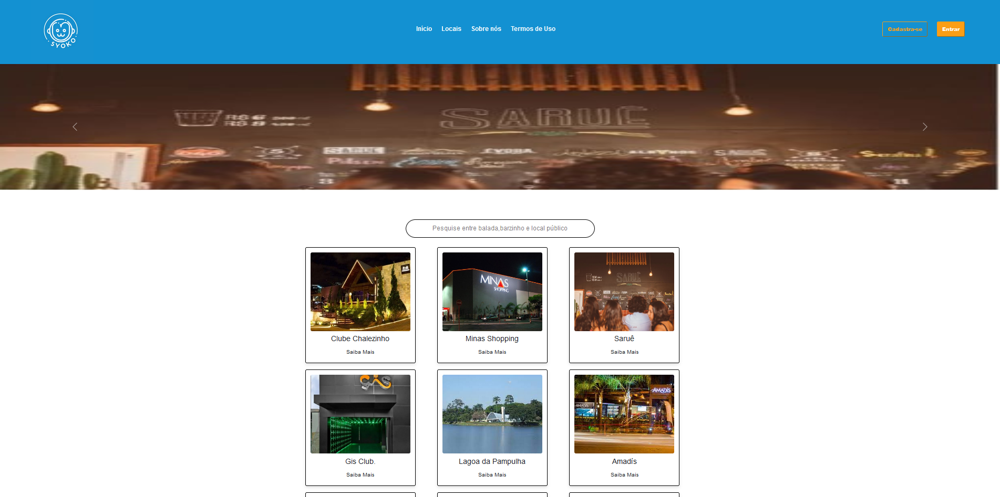

# Informações do Projeto  

......  PROJETO SYOKO ......

`CURSO` 

......  ANÁLISE E DESENVOLVILMENTO DE SISTEMAS ......

## Participantes

> Os membros do grupo são: 
> - Amor Thedim Neto Ferreira
> - Gabriela Cristina Freitas de Lima
> - Gledson Cauã Pinheiro Leão
> - Iago Pereira Alves
> - Mariana Martins Moreira
> - Sara Marçal Rocha

# Estrutura do Documento

- [Informações do Projeto](#informações-do-projeto)
  - [Participantes](#participantes)
- [Estrutura do Documento](#estrutura-do-documento)
- [Introdução](#introdução)
  - [Problema](#problema)
  - [Objetivos](#objetivos)
  - [Público-Alvo](#público-alvo)
- [Especificações do Projeto](#especificações-do-projeto)
  - [Personas](#personas)
  - [Histórias de Usuários](#histórias-de-usuários)
  - [Requisitos](#requisitos)
- [Projeto da Solução](#projeto-da-solução)
  - [Wireframes](#wireframes)
  - [Mapa de navegação](#mapa-de-navegação)
- [Conclusões](#avaliação-da-aplicação)
- [Referências Bibliográficas](#Referências-Bibliográficas)
  
# Introdução

Na sociedade contemporânea, o mundo está em constante evolução, passando por mudanças progressivas e cada vez mais rápidas. Um exemplo claro disso é a revolução digital, que tem causado impactos significativos em diversos setores, bem como as revoluções sociais, que têm promovido transformações profundas na forma como os indivíduos se relacionam e se organizam como corpo social.

Dessa forma, em uma sociedade que possui estruturas excludentes, o acesso de pessoas com deficiência (PCDs), neurodivergentes, LGBTQIA+ e pessoas não brancas aos ambientes comunitários pode se tornar um desafio significativo. Essa dificuldade resulta na violação de sua dignidade, bem-estar e direitos, sem que medidas efetivas sejam tomadas para resolver essas questões. Sendo assim, infelizmente, essa situação acaba gerando uma vulnerabilidade civil para esses grupos específicos, fato muito corriqueiro no Brasil que, segundo pesquisa “Os Perigos da Percepção”, realizada pelo instituto Ipsos, é o 6º colocado em novo ranking de "países mais ignorantes do mundo".

Diante disso, torna-se imprescindível a união entre tecnologia e inclusão, buscando combater o preconceito e proporcionar que os sujeitos citados anteriormente não apenas desfrutem de sua cidadania, mas também desfrutem da diversidade e da convivência social, contribuindo para uma comunidade mais enriquecida em experiências e perspectivas. Portanto, é fundamental promover e apoiar iniciativas nesse sentido, representando um passo importante rumo à construção de um mundo mais inclusivo e acolhedor para todos.

## Problema

Conforme evidenciado pelo Laboratório das Desigualdades Mundiais, o Brasil ocupa a segunda posição em desigualdade entre os países do G20. Essa desigualdade é especialmente sentida pelos grupos marginalizados, incluindo a comunidade LGBTQIA+, pessoas com deficiência (PCDs), mulheres e indivíduos não brancos. Tais grupos enfrentam barreiras decorrentes da falta de acessibilidade e da persistência do preconceito em ambientes públicos e privados. Essa exclusão os priva da participação plena na sociedade, reduzindo a igualdade de oportunidades e limitando sua presença em espaços de lazer, como bares, restaurantes, baladas e outros locais voltados para a interação social.

Esses desafios, oriundos da desigualdade e da falta de acessibilidade, impactam diretamente a participação e o envolvimento desses grupos na esfera social, contribuindo para a perpetuação da exclusão e restringindo seu acesso a ambientes que deveriam ser igualmente acessíveis a todos os membros da sociedade.

## Objetivos

O propósito central do Syoko é aprimorar a experiência dos grupos marginalizados em ambientes públicos e privados, fomentando a inclusão e a acessibilidade. Esse objetivo será alcançado por meio de recursos de avaliação, visando integrar e priorizar as necessidades de lazer dos usuários, muitas vezes ignoradas pela sociedade. O Syoko capacitará os usuários para avaliar e criticar ativamente estabelecimentos, contribuindo para a priorização das necessidades de lazer desses grupos e promovendo uma participação mais democrática e igualitária na vida cívica.

Para atingir esses objetivos, destacamos:

- Facilitação da avaliação ativa: Oferecimento de funcionalidades intuitivas para que os usuários avaliem e critiquem estabelecimentos de forma acessível.
-Promoção da comunidade: Capacitação dos usuários para armazenar suas avaliações, permitindo que a comunidade recomende locais e enriqueça a experiência de outros usuários.

  
## Público-Alvo

Apesar do SkyoKo poder beneficiar toda a sociedade, o projeto tem como foco maior atingir indivíduos que enfrentam desafios significativos de inclusão e acessibilidade devido a barreiras sociais e estruturais.

Dessa maneira, firmou-se como público- alvo as pessoas com deficiência (física, mental, intelectual ou sensorial), os neurodivergentes (pessoas que têm um desenvolvimento ou funcionamento neurológico diferente do padrão), os membros da comunidade LGBTQIA+ (Lésbicas, Gays, Bissexuais, Transgêneros, Queer, Questionando, Intersexuais, Assexuais,+) e as pessoas não-brancas (indigenas, amarelos e pretos). Ademais, considera-se que esse público eesteja localizado em Belo Horizonte ou na regão metropolitana, tenha acesso à internet e esteja familiarizado com o acesso à aplicações web, não sendo necessário um conhecimento tecnológico aprofundado pois o software tem o objetivo de ser de fácil uso.

# Especificações do Projeto

Entre as técnicas utilizadas no projeto, pode-se citar: DesignThinking, SCRUM
Entre as ferramentas utilizadas no projeto, pode-se citar: Canva, Paint

Vizualize abaixo os Artefatos do Processo de Design Thinking 

## Personas

> 
> **Exemplo de Ficha**
> 
> 
> 
> 
 

## Histórias de Usuários

Com base na análise das personas forma identificadas as seguintes histórias de usuários:

|EU COMO... `PERSONA`| QUERO/PRECISO ... `FUNCIONALIDADE` |PARA ... `MOTIVO/VALOR`                 |
|--------------------|------------------------------------|----------------------------------------|
|    LIA SIQUEIRA    | Avaliar estabelecimentos visitados | Saber onde será agradável e seguro de  |
|                    |                                    | visitar                                |
|--------------------|------------------------------------|----------------------------------------|
|    CAIO MARTIN     | Ver a avaliação de outras pessoas  | Interagir com a comunidade             |
|                    |                                    |                                        |
|--------------------|------------------------------------|----------------------------------------|
|    LUIZA LIMA      | Ter um espaço que ensine a navegar | Para poder participar e não ter        | 
|                    | pelo site                          | dificuldades tecnológicas              | 
|--------------------|------------------------------------|----------------------------------------|
|    LUIZA LIMA      | Ter um perfil pessoal que torne    | Para maior usabilidade e               |
|                    | possin fazer *login*/*logoff*      | individualização do usuário            |          
|--------------------|------------------------------------|----------------------------------------|
|    JOÃO SILVA      | Poder pesquisar locais com filtro  | Para otimização da pesquisa            |
|                    | de tipos de estabelecimento        |                                        |
|--------------------|------------------------------------|----------------------------------------|
|    JOÃO SILVA      | Poder comentar a respeito de um    | Para melhor usabilidade                |
|                    | local                              |                                        |
|--------------------|------------------------------------|----------------------------------------|

## Requisitos

A tabela que segue apresenta os requisitos funcionais do projeto. 

### Requisitos Funcionais

|ID    | Descrição do Requisito                                                 | Prioridade |
|------|-----------------------------------------|----|
|RF-001| Permitir que o usuário crie uma conta pessoal.                              | ALTA | 
|RF-002| Deve permitir que o usuário faça login.                                     | ALTA |
|RF-003| Permitir a edição de elementos marcados como favoritos.                  | ALTA |
|RF-004| Incluir filtro por classificação para estabelecimentos..                      | ALTA |
|RF-005| Implementar sistema de avaliação com nota e comentários.	                    | ALTA |
|RF-009| Integrar funcionalidade de compartilhamento em redes sociais.                      | ALTA |
|RF-010| Deve dar a possibilidade ao usuário de visitar paginas de outros usuários.  | ALTA |
|RF-006| Deve ser permitido compartilhar perfis de estabelecimentos em redes sociais.| MÉDIA| 
|RF-007| Integrar informações dos estabelecimentos com serviços de mapas para facilitar a localização e direções.                           | MÉDIA|
|RF-008| Oferecer a opção de deixar feedback de forma anônima para encorajar opiniões sinceras e objetivas.        | MÉDIA|
|RF-011| Oferecer a opção de deixar feedback de forma anônima para encorajar opiniões sinceras e objetivas.        | BAIXA|
|RF-012| Implementar uma área de interação direta entre os usuários para compartilhar experiências, dicas e fazer perguntas.       | BAIXA|

### Requisitos Não Funcionais

|ID   | Descrição do Requisito                                                 |Propriedade|
|-----|------------------------------------------------------------------------|-----------|
|RNF-1| O site deve ser responsivo                                             | ALTA      |
|RNF-2| Deve ser compatível com todos os navegadores                           | ALTA      |
|RNF-3| O site deve suportar vários usuários simultaneamente                   | ALTA      |

### Restrições

|ID   | Descrição do Requisito                                               
|-----|----------------------------------------------------------|
|Rt-1 | A biblioteca sera limitada por três itens em cada seção  |             
|Rt-2 | 

# Projeto da Solução

......  As tecnologias utilizadas serão: HTML, CSS, JAVASCRIPT, BOOTSTRAP, FIGMA, CANVA. ......

## Wireframes

**Tela Principal**
> 

**Biblioteca Pessoal**
> 

**Faça sua avaliação**
> 

**Lista de Locais**
> 

**Biblioteca de Amigos**
> 

**Sobre Nós**
>  

**Contate-nos**
>

**Termos de uso**
> 

**Cadastro**
>

**Guia do usuário**
> >

**Editar Perfil**
>

## Mapa de navegação

> **Diagrama de Navegação**
> 

# Conclusões

Em síntese, no contexto do século XXI, a sociedade está gravidamente se tornando mais consciente a respeito das práticas discriminatórias com as minorias. Entretanto, é evidente que esse processo de mudança está ocorrendo de forma lenta. Por isso, é nesse contexto que o projeto Syoko surge como uma ferramenta eficaz para garantir a proteção desses grupos minoritárs que se sentem inseguros nos espaços de lazer.

Dessa forma, esse projeto representa um avanço notável na direção da inclusão e acessibilidade digital. Ao adotar uma abordagem abrangente, o Syoko se posiciona como uma solução inovadora para abordar as lacunas de acessibilidade e promover a inclusão de diferentes públicos.

Com uma paleta de cores cuidadosamente selecionada, tipografia legível e design responsivo, o Syoko prioriza a acessibilidade, garantindo que seu conteúdo seja facilmente compreensível e navegável para todos os usuários. Além disso, a preocupação com a compatibilidade com diversos navegadores e dispositivos demonstra um compromisso firme com a acessibilidade universal.

Ao oferecer um ambiente online intuitivo e funcional, o Syoko não apenas reduz as barreiras tradicionais de acesso à informação, mas também promove a inclusão digital. Sua abordagem focada na usabilidade e na criação de uma comunidade colaborativa reflete um compromisso genuíno com a igualdade de oportunidades no mundo digital.

Por meio da combinação de design acessível e funcionalidades interativas, o Projeto Syoko transcende as limitações convencionais, tornando-se um recurso valioso para a sociedade. Sua capacidade de oferecer uma experiência digital inclusiva não apenas beneficia indivíduos com necessidades específicas, mas também enriquece a experiência online de todos os usuários, promovendo um ambiente mais equitativo e acessível para a sociedade como um todo.

Assim, o Syoko não apenas resolve desafios de inclusão e acessibilidade, mas também destaca-se como uma plataforma significativa, impulsionando a igualdade e a acessibilidade digital em benefício de toda a sociedade.

 # Referências Bibliográficas

BUENO,  Mariza  Schuster.  Direito  das  minorias  e  as  políticas  publicas  frente  aos  direitos  fundamentais.Revista  Eletrônica  Direito  e  Política,        Itajaí,    v.2,    n.1,    1º    quadrimestre    de    2007.  Disponível em: www.univali.br/direitoepolitica - ISSN 1980-7791

Ipsos. Perigos da Percepção 2016. Acesso em 8 de setembro de 2023. Disponível em: https://www.ipsos.com/pt-br/perigos-da-percepcao-2016.

Technological Revolutions and Societal Transitions. ETUI Research Paper - Foresight Brief #04-April 2018. Disponível em: https://papers.ssrn.com/sol3/papers.cfm?abstract_id=3180000. Acesso em 8 de setembro de 2023.

Rock Content. Acesso em 10 de setembro de 2023. Disponível em: https://rockcontent.com/br/blog/design-thinking/.

Design Thinkers Academy. Acesso em 10 de setembro de 2023. Disponível em: https://www.designthinkersacademy.com/brazil/.

Hostinger. O que é UX Design. Acesso em 12 de setembro de 2023. Disponível em: https://www.hostinger.com.br/tutoriais/o-que-e-ux-design/.

FIA - Fundação Instituto de Administração. Metodologias Ágeis. Acesso em 13 de setembro de 2023. Disponível em: https://fia.com.br/blog/metodologias-ageis/.

Rock Content. Metodologias Ágeis. Acesso em 13 de setembro de 2023. Disponível em: https://rockcontent.com/br/blog/metodologias-ageis/.

Fundo Brasil. Edital Enfrentando o Racismo. Fundo Brasil. Acesso em 20 de setembro de 2023. https://www.fundobrasil.org.br/edital/enfrentandoracismo/.

Agência de Notícias IBGE. IBGE mostra as cores da desigualdade. Acesso em 20 de setembro de 2023. Disponível em: https://agenciadenoticias.ibge.gov.br/agencia-noticias/2012-agencia-de-noticias/noticias/21206-ibge-mostra-as-cores-da-desigualdade.

Guia do Estudante. Minorias Sociais: o que você precisa saber sobre o tema. Acesso em 20 de setembro de 2023. Disponível em: https://guiadoestudante.abril.com.br/atualidades/minorias-sociais-o-que-voce-precisa-saber-sobre-o-tema/.

Politize!. O que são minorias? Acesso em 20 de setembro de 2023. Disponível em: https://www.politize.com.br/o-que-sao-minorias/.
 

