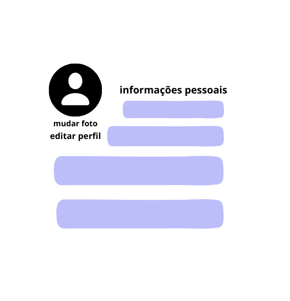

# Informações do Projeto  

......  PROJETO SYOKO ......

`CURSO` 

......  ANÁLISE E DESENVOLVILMENTO DE SISTEMAS ......

## Participantes

> Os membros do grupo são: 
> - Amor Thedim Neto Ferreira
> - Gabriela Cristina Freitas de Lima
> - Gledson Cauã Pinheiro Leão
> - Iago Pereira Alves
> - Mariana Martins Moreira
> - Sara Marçal Rocha

# Estrutura do Documento

- [Informações do Projeto](#informações-do-projeto)
  - [Participantes](#participantes)
- [Estrutura do Documento](#estrutura-do-documento)
- [Introdução](#introdução)
  - [Problema](#problema)
  - [Objetivos](#objetivos)
  - [Público-Alvo](#público-alvo)
- [Especificações do Projeto](#especificações-do-projeto)
  - [Personas](#personas)
  - [Histórias de Usuários](#histórias-de-usuários)
  - [Requisitos](#requisitos)
- [Projeto da Solução](#projeto-da-solução)
  - [Wireframes](#wireframes)
  - [Mapa de navegação](#mapa-de-navegação)
- [Conclusões](#avaliação-da-aplicação)
- [Referências Bibliográficas](#Referências-Bibliográficas)
  
# Introdução

Na sociedade contemporânea, o mundo está em constante evolução, passando por mudanças progressivas e cada vez mais rápidas. Um exemplo claro disso é a revolução digital, que tem causado impactos significativos em diversos setores, bem como as revoluções sociais, que têm promovido transformações profundas na forma como os indivíduos se relacionam e se organizam como corpo social.

Dessa forma, em uma sociedade que possui estruturas excludentes, o acesso de pessoas com deficiência (PCDs), neurodivergentes, LGBTQIA+ e pessoas não brancas aos ambientes comunitários pode se tornar um desafio significativo. Essa dificuldade resulta na violação de sua dignidade, bem-estar e direitos, sem que medidas efetivas sejam tomadas para resolver essas questões. Sendo assim, infelizmente, essa situação acaba gerando uma vulnerabilidade civil para esses grupos específicos, fato muito corriqueiro no Brasil que, segundo pesquisa “Os Perigos da Percepção”, realizada pelo instituto Ipsos, é o 6º colocado em novo ranking de "países mais ignorantes do mundo".

Diante disso, torna-se imprescindível a união entre tecnologia e inclusão, buscando combater o preconceito e proporcionar que os sujeitos citados anteriormente não apenas desfrutem de sua cidadania, mas também desfrutem da diversidade e da convivência social, contribuindo para uma comunidade mais enriquecida em experiências e perspectivas. Portanto, é fundamental promover e apoiar iniciativas nesse sentido, representando um passo importante rumo à construção de um mundo mais inclusivo e acolhedor para todos.

## Problema

Conforme foi apresentado, o problema central reside na exclusão enfrentada pelos grupos marginalizados, como a comunidade LGBTQIA +, PCDs, mulheres e pessoas não brancas. Essa exclusão é causada pela falta de acessibilidade e pela persistência do preconceito em locais públicos e privados. Como resultado, esses grupos são severamente limitados em sua participação plena na sociedade, o que reduz a igualdade e aumenta a inclusão em espaços de lazer, como bares, restaurantes, baladas e demais ambientes que visam interação social.

## Objetivos

O objetivo central do Syoko é ampliar a experiência de grupos marginalizados em ambientes públicos e privados, promovendo assim a inclusão e acessibilidade. Esse objetivo será cumprido por meio de aplicações de avaliação, a fim de incluir e priorizar as necessidades de lazer dos usuários, que são muitas vezes negligenciadas pela sociedade. Por esse motivo, o Syoko permitirá que os usuários avaliem e critiquem ativamente estabelecimentos, contribuindo para a priorização das necessidades de lazer desses grupos e tornando a vida cívica mais democrática e igualitária.

Como objetivos específicos, pode-se destacar:
- Facilitar a avaliação ativa: fornecer funcionalidades que o usuário avalie e critique os estabelecimentos de forma acessível e intuitiva;
- Fomentar a comunidade: permitir ao usuário armazenar, ordenar compartilhar as suas avaliações, checar os locais que a(s) comunidade(s) recomendam e assim contribuir para que outros usuários também tenham essa experiência.

  
## Público-Alvo

Apesar do SkyoKo poder beneficiar toda a sociedade, o projeto tem como foco maior atingir indivíduos que enfrentam desafios significativos de inclusão e acessibilidade devido a barreiras sociais e estruturais.

Dessa maneira, firmou-se como público- alvo as pessoas com deficiência (física, mental, intelectual ou sensorial), os neurodivergentes (pessoas que têm um desenvolvimento ou funcionamento neurológico diferente do padrão), os membros da comunidade LGBTQIA+ (Lésbicas, Gays, Bissexuais, Transgêneros, Queer, Questionando, Intersexuais, Assexuais,+) e as pessoas não-brancas (indigenas, amarelos e pretos). Ademais, considera-se que esse público eesteja localizado em Belo Horizonte ou na regão metropolitana, tenha acesso à internet e esteja familiarizado com o acesso à aplicações web, não sendo necessário um conhecimento tecnológico aprofundado pois o software tem o objetivo de ser de fácil uso.

# Especificações do Projeto

Entre as técnicas utilizadas no projeto, pode-se citar: DesignThinking, SCRUM
Entre as ferramentas utilizadas no projeto, pode-se citar: Canva, Paint

Acesse o documento abaixo para visualizar os Artefatos do Processo de Design Thinking (Matriz CSD, Mapa de Stakeholders, Diagrama de Personas, Mural de Possibilidades e Mapa de Priorização):

----> ADCIONAR PDF AQUI<-----------

## Personas

> 
> **Exemplo de Ficha**
> 
> 
> 
> 
 

## Histórias de Usuários

Com base na análise das personas forma identificadas as seguintes histórias de usuários:

|EU COMO... `PERSONA`| QUERO/PRECISO ... `FUNCIONALIDADE` |PARA ... `MOTIVO/VALOR`                 |
|--------------------|------------------------------------|----------------------------------------|
|    LIA SIQUEIRA    | Avaliar estabelecimentos visitados | Saber onde será agradável e seguro de  |
|                    |                                    | visitar                                |
|--------------------|------------------------------------|----------------------------------------|
|    CAIO MARTIN     | Ter uma biblioteca pessoal de      | Manter um histórico dos lugares favori-|
|                    | locais melhores avaliados          | tos e lugares que não gostou           |
|--------------------|------------------------------------|----------------------------------------|
|    LUIZA LIMA      | Ter um espaço de "reclame aqui"    | Para poder participar com voz ativa na | 
|                    |                                    | plataforma e reportar possíveis erros  | 
|--------------------|------------------------------------|----------------------------------------|
|    LUIZA LIMA      | Ter um perfil pessoal que torne    | Para maior usabilidade e               |
|                    | possin fazer *login*/*logoff*      | individualização do usuário            |          
|--------------------|------------------------------------|----------------------------------------|
|    JOÃO SILVA      | Poder pesquisar locais com filtro  | Para otimização da pesquisa            |
|                    | de tipos de estabelecimento        |                                        |
|--------------------|------------------------------------|----------------------------------------|
|    JOÃO SILVA      | Poder ver o grafico de fluxo de    | Para melhor usabilidade e              |
|                    | pessoas do estabelecimento         |                                        |
|--------------------|------------------------------------|----------------------------------------|

## Requisitos

A tabela que segue apresenta os requisitos funcionais do projeto. 

### Requisitos Funcionais

|ID    | Descrição do Requisito                                                 | Prioridade |
|------|-----------------------------------------|----|
|RF-001| Permitir que o usuário crie uma conta pessoal.                              | ALTA | 
|RF-002| Deve permitir que o usuário faça login.                                     | ALTA |
|RF-003| Deve ter uma biblioteca pessoal para o usuário cadastrado.                  | ALTA |
|RF-004| Deve ter a opção de editar os elementos da biblioteca.                      | ALTA |
|RF-005| Deve ter um filtro de estabelecimento por classificação.                    | ALTA |
|RF-009| Deve ter um sistema de avaliação por nota e comentário                      | ALTA |
|RF-010| Deve dar a possibilidade ao usuário de visitar paginas de outros usuários.  | ALTA |
|RF-006| Deve ser permitido compartilhar perfis de estabelecimentos em redes sociais.| MÉDIA| 
|RF-007| A biblioteca deve armazenar uma lista de desejos.                           | MÉDIA|
|RF-008| A biblioteca deve ter um histórico de locais avaliados pelo usuário.        | MÉDIA|
|RF-011| A biblioteca deve armazenar uma lista de lugares mais mal avaliados.        | BAIXA|
|RF-012| Deve permitir o usuário fazer comentários e avaliações em tempo real.       | BAIXA|

### Requisitos Não Funcionais

|ID   | Descrição do Requisito                                                 |Propriedade|
|-----|------------------------------------------------------------------------|-----------|
|RNF-1| O site deve ser responsivo                                             | ALTA      |
|RNF-2| Deve ser compatível com todos os navegadores                           | ALTA      |
|RNF-3| O site deve suportar vários usuários simultaneamente                   | ALTA      |

### Restrições

|ID   | Descrição do Requisito                                               
|-----|----------------------------------------------------------|
|Rt-1 | A biblioteca sera limitada por três itens em cada seção  |             
|Rt-2 | 

# Projeto da Solução

......  As tecnologias utilizadas serão: HTML, CSS, JAVASCRIPT, BOOTSTRAP, FIGMA, CANVA. ......
> Descreva brevemente quais tecnologias e/ou frameworks foram utilizados no projeto.

## Wireframes

> 
> **Exemplo**:
> 
> 

> 

> 
> 
> 
>  
>
> 
>
> >
>

## Mapa de navegação

......  COLOQUE AQUI O SEU TEXTO OU DIAGRAMA DE NAVEGAÇÃO .......

> Inclua uma descrição textual ou um diagrama mostrando, sequencialmente, quais ações
> um usuário deve realizar para utilizar todas as características do seu sistema. 

> **Exemplo de Diagrama (opcional, pode ser em texto)**
> 

# Conclusões

Em síntese, no contexto do século XXI, a sociedade está gravidamente se tornando mais consciente a respeito das práticas discriminatórias com as minorias. Entretanto, é evidente que esse processo de mudança está ocorrendo de forma lenta. Por isso, é nesse contexto que o projeto Syoko surge como uma ferramenta eficaz para garantir a proteção desses grupos minoritárs que se sentem inseguros nos espaços de lazer.

Portanto, o site tem como objetivo facilitar o acesso seguro de pessoas em situação de vulnerabilidade aos espaços públicos e privados, garantindo seu direito constitucional de ir e vir. Além disso, busca promover um sentimento de pertencimento e acolhimento, utilizando as experiências dessas pessoas como referência para outros em situações semelhantes. Através da combinação de tecnologia e inclusão, o site proporcionará mais segurança ao recomendar espaços frequentados por usuários que compartilham a mesma vivência.

 # Referências Bibliográficas

BUENO,  Mariza  Schuster.  Direito  das  minorias  e  as  políticas  publicas  frente  aos  direitos  fundamentais.Revista  Eletrônica  Direito  e  Política,        Itajaí,    v.2,    n.1,    1º    quadrimestre    de    2007.  Disponível em: www.univali.br/direitoepolitica - ISSN 1980-7791

Ipsos. Perigos da Percepção 2016. Acesso em 8 de setembro de 2023. Disponível em: https://www.ipsos.com/pt-br/perigos-da-percepcao-2016.

Technological Revolutions and Societal Transitions. ETUI Research Paper - Foresight Brief #04-April 2018. Disponível em: https://papers.ssrn.com/sol3/papers.cfm?abstract_id=3180000. Acesso em 8 de setembro de 2023.

Rock Content. Acesso em 10 de setembro de 2023. Disponível em: https://rockcontent.com/br/blog/design-thinking/.

Design Thinkers Academy. Acesso em 10 de setembro de 2023. Disponível em: https://www.designthinkersacademy.com/brazil/.

Hostinger. O que é UX Design. Acesso em 12 de setembro de 2023. Disponível em: https://www.hostinger.com.br/tutoriais/o-que-e-ux-design/.

FIA - Fundação Instituto de Administração. Metodologias Ágeis. Acesso em 13 de setembro de 2023. Disponível em: https://fia.com.br/blog/metodologias-ageis/.

Rock Content. Metodologias Ágeis. Acesso em 13 de setembro de 2023. Disponível em: https://rockcontent.com/br/blog/metodologias-ageis/.

Fundo Brasil. Edital Enfrentando o Racismo. Fundo Brasil. Acesso em 20 de setembro de 2023. https://www.fundobrasil.org.br/edital/enfrentandoracismo/.

Agência de Notícias IBGE. IBGE mostra as cores da desigualdade. Acesso em 20 de setembro de 2023. Disponível em: https://agenciadenoticias.ibge.gov.br/agencia-noticias/2012-agencia-de-noticias/noticias/21206-ibge-mostra-as-cores-da-desigualdade.

Guia do Estudante. Minorias Sociais: o que você precisa saber sobre o tema. Acesso em 20 de setembro de 2023. Disponível em: https://guiadoestudante.abril.com.br/atualidades/minorias-sociais-o-que-voce-precisa-saber-sobre-o-tema/.

Politize!. O que são minorias? Acesso em 20 de setembro de 2023. Disponível em: https://www.politize.com.br/o-que-sao-minorias/.
 

